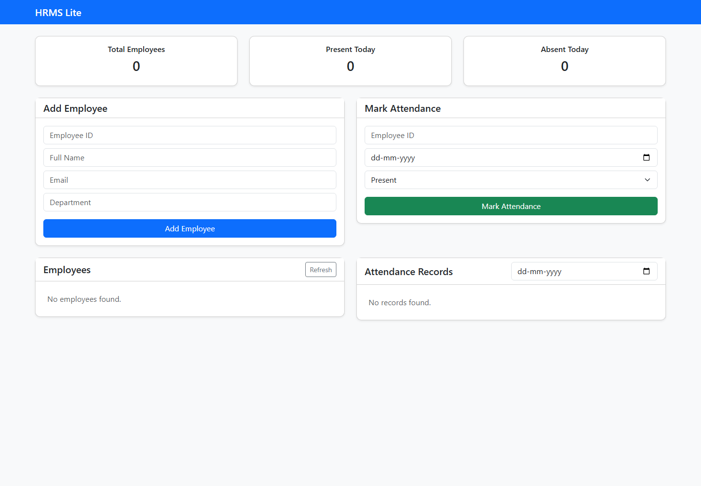

# HRMS Lite

A compact human-resource management system for employee records, attendance tracking, and daily workforce summaries.

HRMS Lite demonstrates a complete Django workflow: relational data modeling, REST endpoints, validation, an AJAX-driven interface, deployment configuration, and container support.



## Features

- Create, list, and remove employee records
- Unique employee ID and email validation
- Record present/absent attendance by date
- Prevent duplicate attendance entries for the same employee and day
- Filter attendance records
- Dashboard totals for employees and daily attendance
- Django admin and browsable REST API
- Docker and Gunicorn deployment configuration

## Tech stack

- Python and Django
- Django REST Framework
- SQLite for local development
- Bootstrap, jQuery, and AJAX
- WhiteNoise and Gunicorn
- Docker

## API

| Method | Endpoint | Purpose |
| --- | --- | --- |
| `GET`, `POST` | `/api/employees/` | List or create employees |
| `GET`, `PUT`, `PATCH`, `DELETE` | `/api/employees/{id}/` | Manage one employee |
| `GET`, `POST` | `/api/attendance/` | List or create attendance |
| `GET`, `PUT`, `PATCH`, `DELETE` | `/api/attendance/{id}/` | Manage one attendance record |

## Run locally

```bash
python -m venv .venv
# Windows: .venv\Scripts\activate
# macOS/Linux: source .venv/bin/activate
pip install -r requirements.txt
copy .env.example .env
cd backend
python manage.py migrate
python manage.py runserver
```

Open `http://127.0.0.1:8000`.

## Run with Docker

```bash
docker build -t hrms-lite .
docker run --rm -p 8000:8000 --env-file .env hrms-lite
```

## Environment variables

| Variable | Purpose | Default |
| --- | --- | --- |
| `DJANGO_SECRET_KEY` | Django signing key | development-only fallback |
| `DEBUG` | Enable debug mode | `True` |
| `ALLOWED_HOSTS` | Comma-separated allowed hosts | `localhost,127.0.0.1` |

## Verification

```bash
cd backend
python manage.py test
python manage.py check
```
